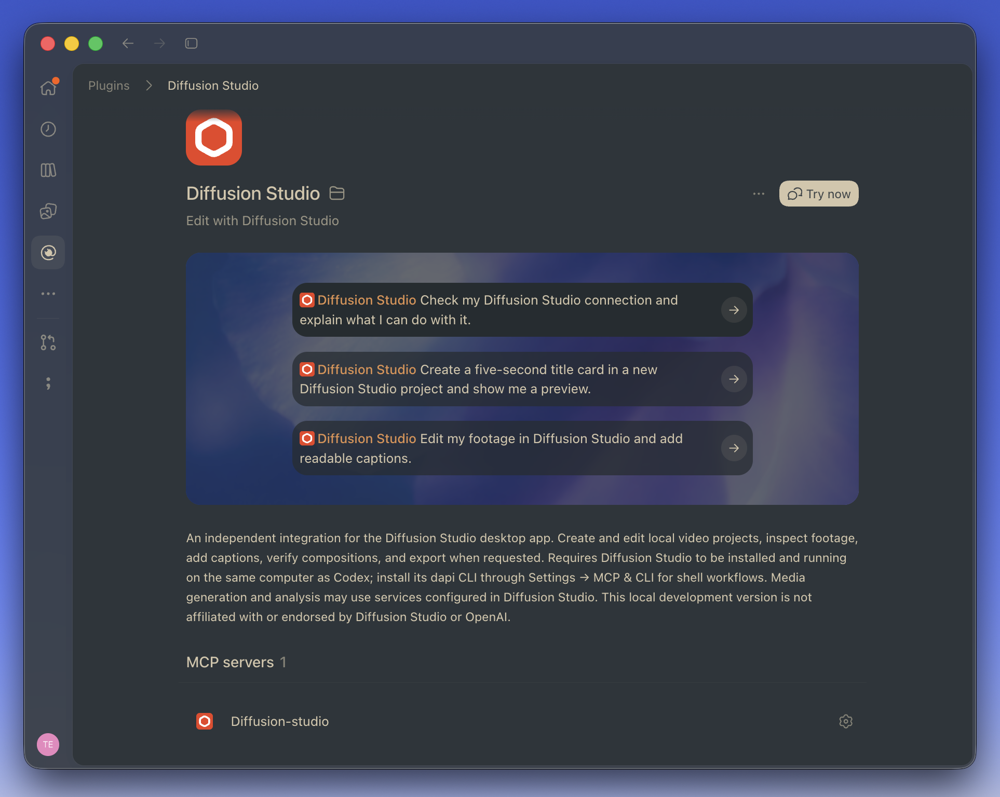

# Diffusion Studio for Codex

An independent Codex plugin for creating, editing, inspecting, and previewing video projects with the Diffusion Studio desktop app.

This is a private development repository. GitHub access is required to clone or install from it. The plugin has not been approved in the OpenAI public plugin directory and is not affiliated with Diffusion Studio or OpenAI.



The screenshot shows the maintainer's personal installation with the official Diffusion Studio logo. This repository's plugin package uses an independent icon; its connection and editing workflow are the same.

## Where it runs

```text
Codex on your computer → Diffusion Studio's local MCP server → editor
         ↘ local project source files ↗
```

Diffusion Studio serves its own MCP endpoint at `http://127.0.0.1:3274/mcp`. Codex connects to that endpoint and edits the local project source. Each user runs their own editor and server. This repository distributes the plugin; GitHub does not run the editing server, and this plugin has no hosted backend.

The plugin does not itself upload footage to GitHub. Diffusion Studio's optional generation and analysis features may use services configured in the app. See that app's settings and policies for those features.

## Requirements

- A local Codex client with plugin support, terminal access, and file access.
- [Diffusion Studio](https://www.diffusion.studio/download) installed and running on the same computer.
- The app's `dapi` CLI for launch and shell workflows; install it through Settings → MCP & CLI.
- Python 3 for the optional connection diagnostic.

macOS was tested. Windows is not yet verified. A remote cloud executor cannot reach your computer's loopback address.

## Install manually

1. Install and open [Diffusion Studio](https://www.diffusion.studio/download).
2. In Diffusion Studio, open **Settings → MCP & CLI** and install `dapi` for shell workflows. Keep the app running.
3. Make sure the `codex` command is available in your terminal. If it is missing, follow the [official Codex CLI setup](https://developers.openai.com/codex/cli).
4. Authenticate Git access to this private repository. Your GitHub account must own the repository or have collaborator access. A private repository URL alone does not grant access. Use your existing Git credential helper or authenticated SSH setup; do not put a GitHub token into the plugin's files.
5. Add the marketplace and install the plugin:

```sh
codex plugin marketplace add Teseife/diffusion-studio-codex --ref main
codex plugin add diffusion-studio@diffusion-studio-community
```

6. Confirm installation:

```sh
codex plugin list --marketplace diffusion-studio-community --json
```

The installed entry should identify `diffusion-studio@diffusion-studio-community` and report `enabled: true`.

7. Start a new Codex chat. If the plugin does not appear immediately in the desktop app, reopen the Plugins view or restart Codex after saving any active work. Find Diffusion Studio under the community marketplace and use **Try now** or select the plugin in a new chat. Keep the editor running.

Try:

> Check my Diffusion Studio connection and explain what I can do with it.

> Create a five-second title card in a new project and show me a preview.

### Alternative: install from a local download or clone

If the direct Git marketplace command cannot authenticate, clone the repository with your existing Git credentials first:

```sh
git clone https://github.com/Teseife/diffusion-studio-codex.git
cd diffusion-studio-codex
codex plugin marketplace add .
codex plugin add diffusion-studio@diffusion-studio-community
```

Alternatively, download the repository ZIP from GitHub while signed in, extract it, open a terminal in the extracted folder, and run the last two commands. Keep that extracted folder: the registered local marketplace points to it. A ZIP checkout does not automatically fetch GitHub updates.

## Install with an agent

Open a local Codex chat with terminal/file access on the computer running Diffusion Studio. Copy and paste:

```text
Install the independent Diffusion Studio plugin from the private GitHub
repository Teseife/diffusion-studio-codex on this computer.

Use my existing GitHub/Git authentication. Check whether Diffusion Studio
and its dapi CLI are installed. If dapi is present, start the editor with
`dapi open --background` without creating a project. If the editor is
missing, tell me how to install it and resume once it is available.

Check existing marketplaces/plugins first. Add the Git marketplace with:
`codex plugin marketplace add Teseife/diffusion-studio-codex --ref main`
and install:
`codex plugin add diffusion-studio@diffusion-studio-community`.
If already installed, refresh that marketplace and install the current version.

If Git cannot access the private repository, explain the access/authentication
problem. Do not request a token in chat or change repository visibility.
An authenticated local clone or extracted GitHub ZIP can be registered instead.

Verify the plugin is installed and enabled, then run its bundled read-only
connection diagnostic from the actual installed or checkout path. Report the
result and remind me to start a new chat to load the plugin tools. Keep my
existing projects and other plugin settings unchanged. Do not generate paid
media, export a video, or publish a GitHub issue as part of this install check.
```

An agent cannot grant itself access to the private repository. Complete any GitHub sign-in or collaborator access step yourself if needed. After installation, use a new chat to test the native plugin tools:

```text
Use Diffusion Studio to check my editor connection and create a five-second
title card in a new project. Show a captured preview without exporting a video.
```

## Install this local checkout

From the repository root:

```sh
codex plugin marketplace add .
codex plugin add diffusion-studio@diffusion-studio-community
```

The community marketplace has a different identity from the personal `diffusion-studio-local` marketplace. If you already use the personal version, enable one copy at a time to avoid duplicate skills and tools.

## Diagnose a connection

From the repository root:

```sh
python3 plugins/diffusion-studio/scripts/doctor.py
```

The diagnostic checks the CLI, MCP handshake, tool discovery, and a read-only context request. A ready connection reports `mcpReady: true`. It does not open projects, generate assets, export files, or file public issues.

If the app is stopped, launch it. If the plugin is newly installed, open a new chat. Check Settings → MCP & CLI if the server remains unavailable.

## Updates

The maintainer increments the plugin version and publishes the updated repository contents. Installed users refresh the Git marketplace and install the current package:

```sh
codex plugin marketplace upgrade diffusion-studio-community
codex plugin add diffusion-studio@diffusion-studio-community
```

Open a new chat to load the refreshed files.

## Package contents

- `.agents/plugins/marketplace.json`: community marketplace catalog.
- `plugins/diffusion-studio/plugin.json`: portable Agent Plugins manifest.
- `plugins/diffusion-studio/mcp.json`: portable Streamable HTTP declaration.
- `plugins/diffusion-studio/.codex-plugin/plugin.json` and `.mcp.json`: Codex compatibility and presentation metadata.
- `plugins/diffusion-studio/skills/diffusion-edit/SKILL.md`: editing workflow, reading the reference shipped with the installed editor.
- `plugins/diffusion-studio/scripts/doctor.py`: read-only diagnostic.
- `plugins/diffusion-studio/assets/icon.svg`: original independent icon.

## Branding and license

Original plugin code, instructions, and the independent icon are MIT licensed. Diffusion Studio remains a separate dependency with its own license and terms. The supplied screenshot depicts Diffusion Studio branding, which is not licensed by this project's MIT license. No official logo asset is bundled into the installable plugin. No app binary, upstream skills, footage, account credentials, or private project data is included.

A personal installation may use a user-selected official icon. A public release using official branding is subject to confirming permission separately.

See [validation and limitations](./VALIDATION.md) and [release notes](./CHANGELOG.md).

References: [Diffusion Studio](https://github.com/diffusionstudio/editor), [Codex plugin packaging and Git marketplaces](https://developers.openai.com/plugins/build/plugins), [MCP deployment requirements](https://developers.openai.com/plugins/build/mcp-server).
